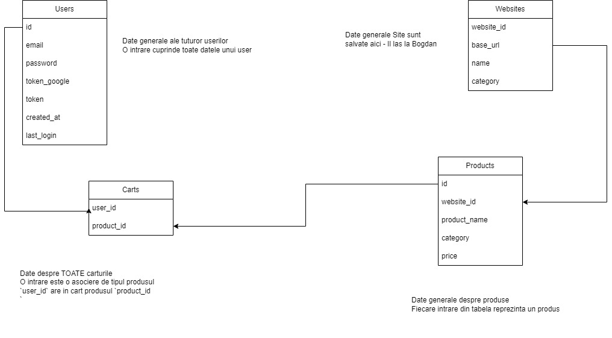

**Note**
> Document pentru descrierea modului de folosire al aplicației
> Deschis la modificări pe întreg parcusrul dezvoltării
> Orice modificare a funcționalității trebuie prezentată și aici pentru a fi adusă la cunoștință și celorlalți

# Cuprins
1. [Constante-și-date-Generale](#Constante-și-date-Generale)
2. [Funcții ale aplicației](#Funcții-ale-aplicației)
4. [Funcționalități-de-implementat-pe-viitor](#Funcționalități-de-implementat-pe-viitor) 
            -> pick one if you finish too quick
3. [Structura Database](#Structura-Database)

# Constante și date Generale:
* basic URL address: `localhost:8000` notat {baseURL}
* jsonField poate avea una din valorile : "PriceDesc", "PriceCresc"
```json
{
   "jsonField" : "PriceDesc" | "PriceCresc"
}
```


# Functii ale aplicatiei

## Register
* Frontend:
   - face POST pe url `{baseURL}/register/` cu 
```json
{
   "email": "givenVALIDemail",
   "password": "encodedPass"
}
```
   - primește răspund de la backend și tratează cazurile de eroare (cu mesaje clare care să expună eroarea)
   - dacă se face cu succes inregistrarea contului se loghează direct in pagina de `Profile`(nu se întoarce in home, sau login)
   
* Backend:
   - are regula pt. când se face POST pe url `{baseURL}/register/`:
   - daca formatul json-ului de input este corect răspunde cu:
```json
{
   "code": "0",
   "token": "setByFastapi",
} // registresation successfully 
``` 
```json
{
   "code": "1",
} // username already used - no need for cookie
``` 
```json
{
   "code": "2",
} // email already used - no need for cookie 
``` 
   - face interogări pe baza de date pentru a vedea toate cele de mai sus (dacă datele sunt corecte)
   - `token_google` se pune pe `NULL`
   - în caz de register cu succes, adaugă userul în tabelul `Users`, de asemenea setează câmpurile de `created_at` și `last_login` la momentul curent
   - generează token conectare pentru sesiune (și il pune in `Users` la userul nou creat)
   - pune tokenul in 
  


## Login
* Frontend:
   - face POST pe url `{baseURL}/login/` cu 
```json
{
   "email": "givenVALIDemail",
   "password": "encodedPass"
}
```
   - primește răspund de la backend și tratează cazurile de eroare (cu mesaje clare care să expună eroarea)
   - dacă se face cu succes logarea contului se redirectează direct in pagina de `Profile`
* Backend:
   - are regula de pt. când se face POST pe url `{baseURL}/login`:
   - daca formatul json-ului de input este corect răspunde cu:
```json
{
   "code": "0",
   "msg": "Login succ",
   "token": "setByFastapi"

} // login successfully 
``` 
```json
{
   "code": "1",
   "msg": "Invalid login",
   "token": ""
} // username or password not valid
``` 
```json
{
   "code": "3",
   "msg": "Already logged in",
   "token": ""
} // user is already logged in
``` 
   - face interogări pe baza de date pentru a vedea toate cele de mai sus (validează datele)
   - în caz de logare cu succes, in tabelul `Users` se actualizează `last_login` si `token`


## Add product to cart
* Extensia:
   - face un POST pe `{baseURL}/addProdToCart`:
```json
{
   "url" : "url-for-the-product-on-the-site",
   "token": "genertedByFastApi"
} // the cookie should be included
```
   - raspunde la mesajele din backend si afiseaza modale cu `Added to cart` sau redirect catre `Login/Register Page` daca userul nu este logat.
* Backend:
   - are regula de pt. când se face POST pe url `{baseURL}/addProdToCart`:
   - daca formatul json-ului de input este corect răspunde cu:
```json
{
   "code": "0",
   "msg": "Add to cart",
} // Userul este logat si produsul a fost adaugat cu succes
``` 
```json
{
   "code": "1",
   "msg": "Not logged in"
} // nu are un cookie valid pt sesiunea curenta auserului (daca aceasta exista) sau userul nu apare ca logat in baza de date.
``` 
   - adaugă produsul in baza de date in tabela `username` cu toate câmpurile din aceasta


## Get cart
* Frontend:
   - face un POST pe `{baseURL}/getCart/`:
```json
{
   "username": "username",
   "sites": ["Emag", "Amazon"],
   "order": "PriceDesc" | "PriceCresc",
   "token": "generatedByFastapi"
} // the cookie should be included
```
   - raspunde la mesajele din backend 
   - parsează jsonul primit ca raspuns și afisează obiectele corespunzătoare.
   - se verifica sa se trimita doar date valide in campurile `order` și `sites`
> **Note** 
> Dacă nu e valid cookie-ul sau primeste mesaj de la backend ca este un cookie invalid, se deloghează userul și se da redirect in pagina de `Login\Register`.
* Backend:
   - are regula pt. când se face POST pe url `{baseURL}/getCart/`:
   - daca formatul json-ului de input este corect răspunde cu:
```json
{
   "code": "0",
   "msg": "This is your product list",
   "products" : [
      {
         "productName": "name",
         "productPrice": "price",
         "productUrl": "Url"
      },
      {
         "productName": "name2",
         "productPrice": "price2",
         "productUrl": "Url2"
      },
      {
         "productName": "name3",
         "productPrice": "price3",
         "productUrl": "Url3"
      }
   ],
} // cookie is valid and the request makes sense
``` 
```json
{
   "code": "1",
   "msg": "Not logged in"
} // nu are un cookie valid pt sesiunea curenta a userului (daca aceasta exista) sau userul nu apare ca logat in baza de date.
``` 
```json
{
   "code": "2",
   "msg": "quesrry params are bad"
} // ceva e in neregula in `sites` sau `order`
```
   - se face querry catre baza de date pentru a afla produsele
   - Filtre: 
      - afiseaza doar produsele de pe `site`-urile din `sites`
      - in ordinea data de `order`
   - Vezi Structura Baza de Date


# Funcționalități-de-implementat-pe-viitor
## Logout
* Frontend:
   - face POST pe url `{baseURL}/logout/` cu 
```json
{
   "token" : "setByFastApi"
}
```
   - primește răspund de la backend și tratează cazurile de eroare (cu mesaje clare care să expună eroarea)
   - dacă se face cu succes delogarea contului se redirectează direct in pagina de `Home` și se șterge token-ul
* Backend:
   - are regula pt. când se face POST pe url `{baseURL}/logout/`:
   - daca formatul json-ului de input este corect răspunde cu:
```json
{
   "code": "0",
   "msg": "Logout succ",
} // logout succ
``` 
```json
{
   "code": "1",
   "msg": "Invalid token",
} // invalid token for session, BIG PROBLEM, shouldn't happen
``` 
   - face interogări pe baza de date pentru a vedea toate cele de mai sus (validează datele)
   - în caz de delogare cu succes, in tabelul `Users` se actualizează `token`
   **Note** 
   - si `last_login` (actualizăm last login pt a putea vedea cand dureaza se sesiunile) 
   - MAI RAMANE DE STABILIT


## Register with Google


## Login With Google

## Cart Page 
   - link to the official website on `See website` for every product
   - search a word on webiste/websites -> the same filters as for [Get cart](#Get-cart)
   - delete item from cart


## Notifications for discounts
   - notify the user that have the product in cart, that the price has lowered


## Report website

## A way to have some starting data in Database 
   - populate Database with some websites


# Structura Database
   Schema se afla in poza de aici 